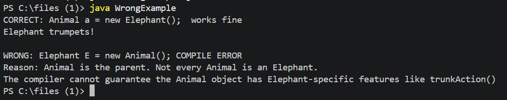
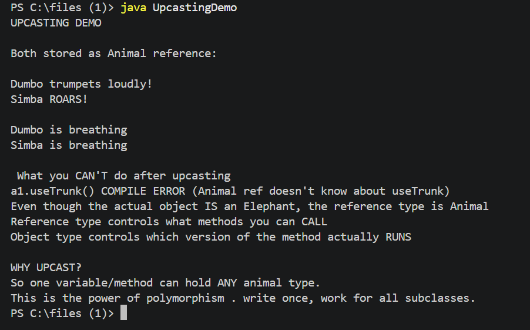
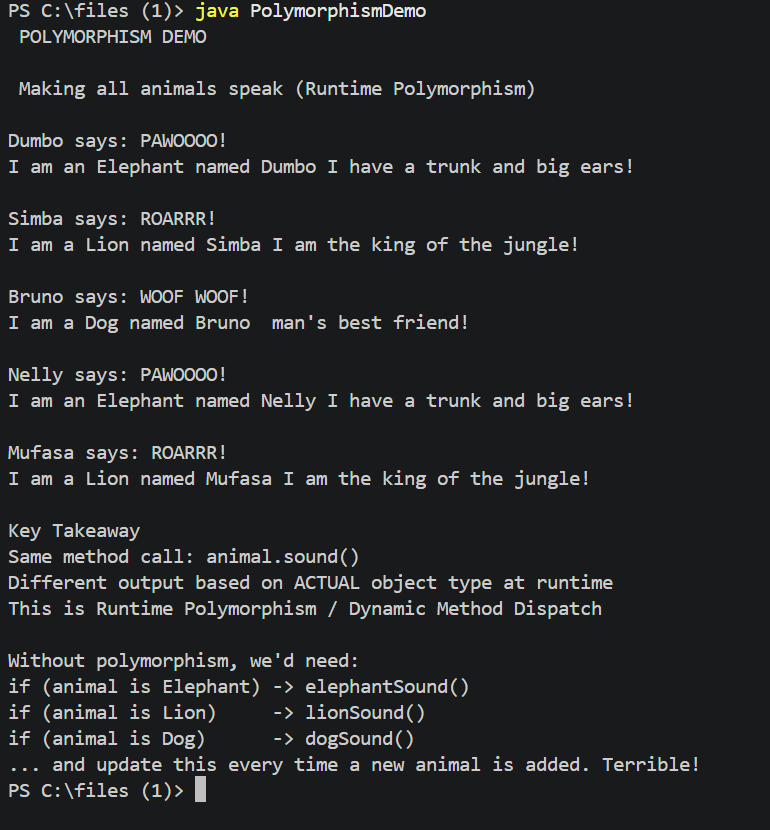
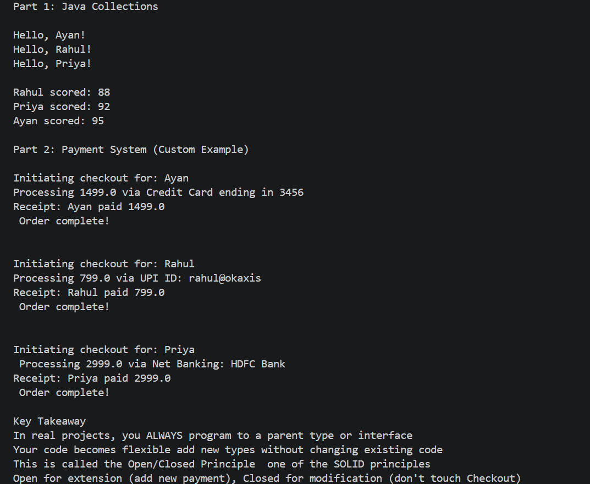

# OOP Concepts in Java — Type System & Polymorphism

> Explored as part of an internship task at Accenture.
> Starting point: **`Elephant E = new Animal();`** — Why is this wrong?

---

## The Question

Elephant E = new Animal();  // Why doesn't this work?

This one line covers a set of core OOP concepts — inheritance, type rules, upcasting, and polymorphism. This repo breaks down everything with working code and outputs.

---

## The Short Answer

**Every Elephant IS an Animal. But NOT every Animal IS an Elephant.**

An Animal object could be a Lion, a Dog, anything. It doesn't have Elephant-specific features. So the compiler rejects it with:

incompatible types: Animal cannot be converted to Elephant

The correct version:

Animal E = new Elephant();  // Upcasting — always safe

---

## Concepts Covered

| # | Concept | File |
|---|---------|------|
| 1 | Why the original line is wrong | 1_wrong_code/WrongExample.java |
| 2 | Upcasting | 2_upcasting/UpcastingDemo.java |
| 3 | Polymorphism (Runtime) | 3_polymorphism/PolymorphismDemo.java |
| 4 | Real-world usage | 5_real_world/RealWorldExample.java |

---

## Concept Breakdown

### 1. The IS-A Rule
Before assigning objects, always ask:
"IS a [right side] a [left side]?"

Animal a = new Elephant();   // Is an Elephant an Animal? YES - works
Elephant e = new Animal();   // Is an Animal an Elephant? NO  - compile error

**Output:**

---

### 2. Upcasting
Storing a child object in a parent reference. Automatic and always safe.

Animal a = new Elephant("Dumbo");
a.sound();  // calls Elephant's sound() — not Animal's

Reference type → controls what methods you can CALL
Object type → controls which version actually RUNS

**Output:**

---

### 3. Polymorphism
Same method call, different behavior depending on actual object type. Decided at runtime.

Animal[] zoo = { new Elephant("Dumbo"), new Lion("Simba"), new Dog("Bruno") };

for (Animal a : zoo) {
    a.sound();  // each animal makes ITS OWN sound
}

Without polymorphism you'd need endless if-else chains. With it — one line handles everything.

**Output:**

---

### 4. Real-World Usage
This pattern appears everywhere in Java:

List<String> list = new ArrayList<>();
Map<String, Integer> map = new HashMap<>();

List and Map are interfaces (like Animal). ArrayList and HashMap are implementations (like Elephant). You program to the general type so you can swap implementations without changing any other code.

**Output:**

---

## How to Run

Make sure you have JDK installed. Then:

cd 1_wrong_code
javac WrongExample.java
java WrongExample

Same pattern for all files — cd into the folder, compile, run.

---

## Key Takeaways

- Upcasting → child to parent, automatic, safe, used for flexibility
- Polymorphism → same reference, different behavior at runtime
- Real rule → program to parent types/interfaces, not specific implementations
- Why it matters → flexible, extensible code — add new subclasses without touching existing logic (Open/Closed Principle)

---
 Accenture Internship 2026*
